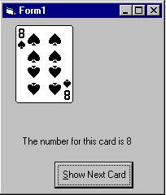

<div align="center">

## View a playing card using VBCARDS\.OCX


</div>

### Description

Simple code shows how to display any playing card image using the VBCRADS.OCX.
 
### More Info
 
Create a form (Form1)

Create a command button control (Button1)

Create an image control (Image1)

Create a label control (Label1)

Create a VBCARDS control (Deck1)

A free copy of the VBCARDS OCX control can be downloaded

at http://bargainbd.com/opusopus/vbcards.htm

or

http://www.geocities.com:80/SiliconValley/Grid/7284/cardocx1.zip

Don't crowd the screen with the controls, space

them neatly

Returns an image of a playing card.

Takes a second or two for the OCX file to load into VB


<span>             |<span>
---                |---
**Submitted On**   |
**By**             |[Patrick K\. Bigley](https://github.com/Planet-Source-Code/PSCIndex/blob/master/ByAuthor/patrick-k-bigley.md)
**Level**          |Unknown
**User Rating**    |5.8 (627 globes from 108 users)
**Compatibility**  |VB 5\.0, VB 6\.0
**Category**       |[Games](https://github.com/Planet-Source-Code/PSCIndex/blob/master/ByCategory/games__1-38.md)
**World**          |[Visual Basic](https://github.com/Planet-Source-Code/PSCIndex/blob/master/ByWorld/visual-basic.md)
**Archive File**   |[](https://github.com/Planet-Source-Code/patrick-k-bigley-view-a-playing-card-using-vbcards-ocx__1-1405/archive/master.zip)

### API Declarations

	Global CountCard As Long


### Source Code

```
Dim CountCard As Integer
 Private Sub Command1_Click()
If CountCard >= 69 Then CountCard = 1
'CountCard can be any number from 1 to 68
'Each number equals different DSeck image.
 Deck1.ChangeCard = CountCard 'Change the Picture property of Deck1
 Image1.Picture = Deck1.Picture 'Copy the picture of Deck1
Label1.Caption = "The number for this card is " & CountCard
CountCard = CountCard + 1
End Sub
Private Sub Form_Load()
CountCard = 1
            'the "Destination pad"
 Image1.Picture = Deck1.Picture 'Copy the picture of Deck1 to image1
End Sub
```

